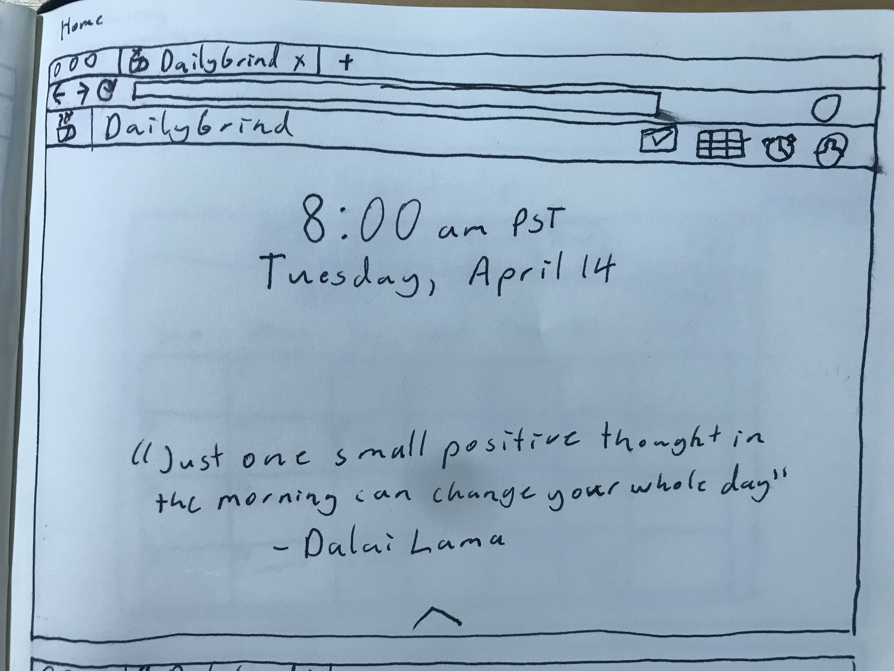
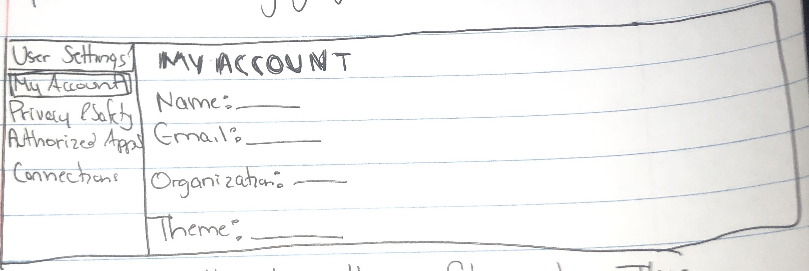
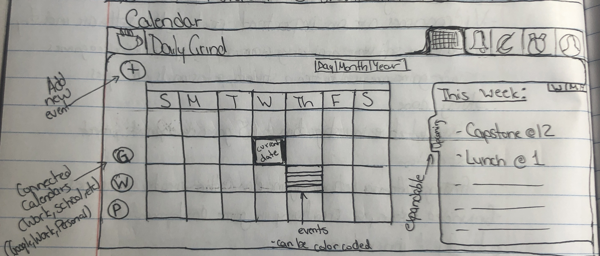
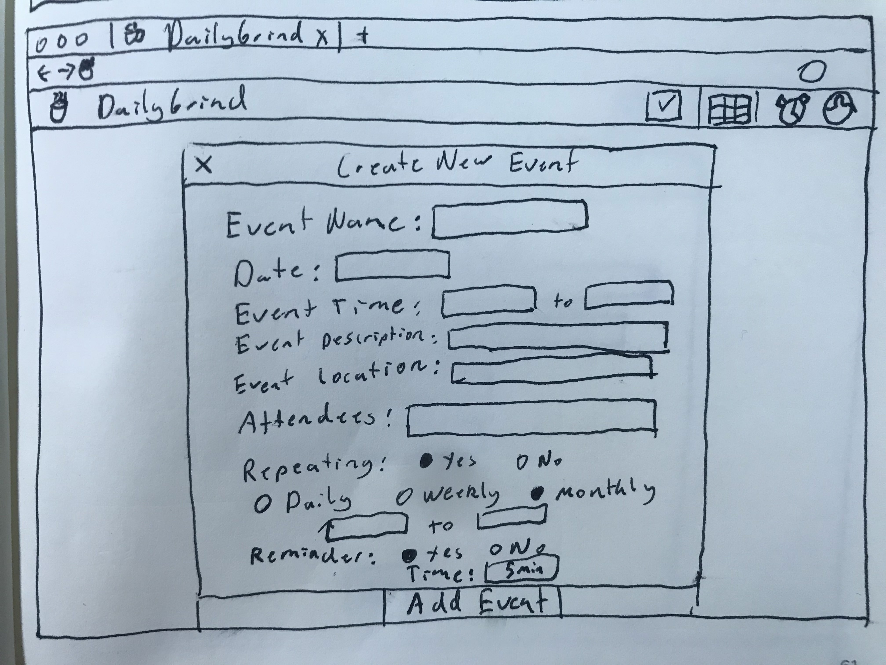
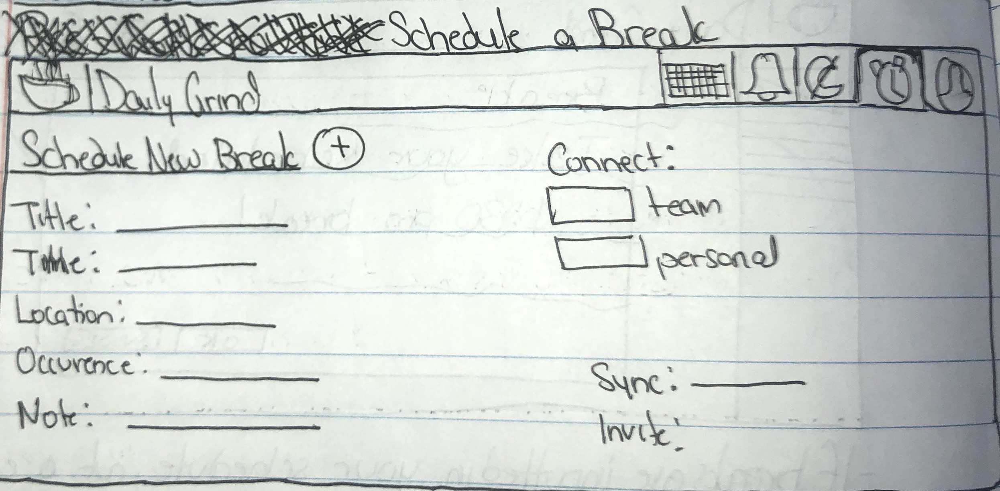
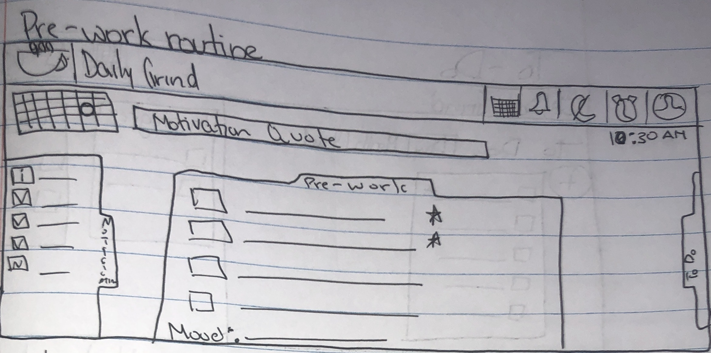
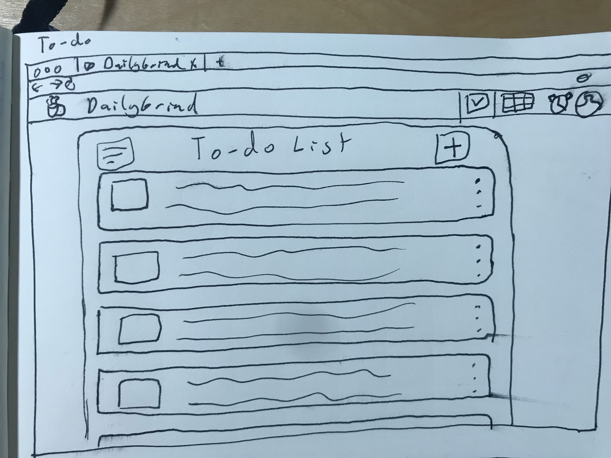

 Requirements

## System Requirements
- *The Daily Grind* will be a web application made up of responsive web pages with < 1 second response times.  
Web based application
Responsive web pages with 1 second response times
Screen size?
System will be created with the React framework.
All images will include alt labels.
Aria labels will be included on assets.
Google api will be used to sync user calendars with DailyGrind’s
Data will be stored through Firebase.

## Loading Screen & Home Page

- When the site is opened for the first time that day, it will display the current date (Month name, Date number, i.e. April 22) and day of the week in the center of the screen. 
- Settings, schedule, to-do lists, pre-work routines, and breaks will be accessible from the home page through a navigation bar with clickable links to the respective pages.

## Sign-In & Sign-Up
- Users will be able to create an account by filling out a form or via institutions Google 
- The sign up form will require an email, password, and name. 
- When the user is not signed in, the user will be able to sign in by clicking sign in on the navigation bar.
- When the user is signed into the site, the user will have an option to sign-out by navigating through the menu to the sign-out button. 
- User cookies will time out after 48 hours.

## Settings

- The navigation bar will have a button titled “Settings” that, when clicked, will take the user to the settings page.
- The settings page will allow users to toggle which applications have access and authority to connect to Daily Grind.
- Applications that are in the authorization page will have a toggle form, where enabling the toggle will allow applications to connect to Daily Grind while disabling will prevent applications from connecting to Daily Grind.
- Account settings can be changed by clicking on the “My Account” tab under user settings, by clicking on the edit button, allowing for change to either name, email, organization, and theme.

## Scheduling/Calendar

- The navigation bar will have a button titled “Schedule” that, when clicked, will take the user to the schedule/calendar.
- Upon opening the scheduling page, the system will show a calendar and display the day/week/month view based on user settings from the settings page
    - Buttons centered above the calendar for viewing the calendar daily, weekly, or monthly will allow for switching between views  
    

- A button with a “plus” icon will allow the addition of new events. 
    - Clicking this button will open up a new event form modal for users to input information about the event containing the following specifications: 
        1. The title of “Create New Event” is at the top of the form, center-aligned in 16 pt font
        2. It will display the text “Event Name” aligned left with a text input field to the right of Event Name
        3. It will display the text “Event Date” below Event Name aligned left with a text input field to the right of Event Date. 
            - The input will be constrained to the format “MM/DD/YYYY”
        4. It will display the text “Time Range” below Event Date aligned left with two input fields to the right of Time Range with “to” in-between them. 
            - There will be a toggle for AM/PM to the right of both input fields
            - The input will be constrained to the format “HH:MM”
        5. It will display the text “Location” aligned left with a text input field to the right of Location
        6. It will display the text “Event Description” aligned left with a text input field below the text
            - The input field will automatically increas in height to accommodate all user inputted text
            - The input will be constrained to 500 characters
        7. It will display the text “Attendees” aligned left with a text input field below the text
            - Input field will be search box for the names of users within the event creator’s organization
        8. It will display the text “Repeating Event?” with a yes/no checkbox input to the right of Repeating Event?
            - If yes is selected:  
            1. A checkbox input field for the regularity of the event between daily, weekly, and monthly will appear below the yes/no checkbox input listed above.  
            2. Two text inputs labelled “Start date” and “End date” will appear below the regularity of repetition
                - The input will be constrained to the format “MM/DD/YYYY”
        9. It will display the text “Reminder?” with a yes/no checkbox to the right of Reminder?
            - If yes is selected:
                1. A dropdown selector for the amount of time before the event for the reminder to be sent, with the options: At the start time, 5 minutes before, 10 minutes before, 15 minutes before, 30 minutes before, an hour before, and a day before.
                2. Reminders will appear as notifications from the web app at the selected time above (see “Alerts” section for a description of its format).
        10. It will display an “Add Event” button centered at the bottom of the modal
            - When selected, the system will add the event with all the settings and descriptive information entered above to the calendar.
            - If a user input in an input field does not fit within the constraints, add new event will fail. The user will receive an error message next to incorrect fields notifying them of the incorrect input fields and the constraints of each field.
            - Blank event forms will fail when add event button is selected and notify the user that they must at least input text into event name and date
- On right click or single tap of a specific day/time/event on the calendar a pop-up menu appears giving users several options: Create new event, Edit event, or Delete event.
- On a single left click or single tap of an existing event pop-up box is created showing users a preview of the event.
    - This preview will display the event name at the top, the event time, alert time, and a button to edit the event.
- Users can connect their Daily Grind Calendar with their Google Calendar by selecting the “Connect to Google Calendar” button.
    - User will be prompted by a google login box to enter gmail address and password
    - Google events are shown on the calendar
    - Events created in the web app are shown on their Google calendar 

## Breaks

- When a user’s break is scheduled, it will pop up on the screen, allowing the user to either snooze it or start their break. 
    - If start is selected, user-selected work websites will be temporarily blocked until the break is complete. 
    - If snooze is selected, there will be a default time of 10 minutes until the break pop-up reappears.
        - The default time can be changed in the break tabs if the user is logged in. The user can also change the default snooze time according to their needs in the break tab. 
- Prior to a break ending, there will be a pop up on the screen displaying how much time is left to the user.
    - This notification will come halfway through the allotted time for the break and one minute before their break is up.
- The size of the break notification at the top of their screen will be adjustable to avoid distractions, if they are logged in. 

## Pre-Work Routines

- When the user logs in to the Daily Grind, the system will display the pre-work routine checklist.
- When a user is logged in, their pre-work routine will be customizable.
- Each checklist item will have an unfilled “star” icon to the right of it; once selected, it will have a solid fill and will move to the top of the checklist.
- All pre-work routine items will allow users to snooze or set a start time
- Users can add or delete items in their pre-work routine in the pre-work routine tab.
    - To add an item in the pre-work routine, users will click the “plus” button at the top of the tab, and fill in the task as needed.
    - To delete an item, users will select the item they want to delete by clicking on it. A menu will appear with a delete button as an option. If the user clicks on the delete button, they can either confirm or cancel. 
        - If confirm is selected, the pre-work item will be deleted.
        - If cancel is selected, the user can return to the previous page and the item will remain as it was before. 

## To-Do List

- The to-do list will have a button that when clicked, will add an item to the bottom of the to-do list.
- The to-do list will be accessible by the navigation bar, where the To-Do list can be clicked to go to the to-do list page. 
- When an item is added, labels/tags and tags can be added to the item to categorize it.
    - Tags can be added to items by clicking the edit button, where the system will ask for input text of the desired tag name. 
- When an item is added, colors can be added to an item to customize it.
    - Colors can be added to an item by clicking the appropriate color from a small menu of colors when an item is added.
- When an item is added, there will be a drop-down menu to determine the importance of an item when that same menu is clicked, with a list of options ranging from least importance to most importance.
- Items on the to-do list can be edited by clicking on the item, opening a small menu with fields to edit (color, text, tags, importance(, where clicking on the fields will open a menu with an input to edit.
- Items can be deleted from the to-do list by clicking on the item on the list, opening a small menu with a delete button that users can confirm or cancel.
- To-do list items can only consist of text elements/rendered as strings. 
- Information for the to-do list will be stored within the database. Whenever a to-do list item is added, it will be stored in the database under the user's account.
- Items on the to-do list can be ordered by level of importance by clicking the filter button on the top-right of the to-do list menu and clicking the appropriate filter. 

## Alerts
- The navigation bar will have a button titled “Alerts” that, when clicked, will take the user to the alerts page.
- When a user receives a time-sensitive alert (break time, meeting starting, etc.), it will pop-up in the middle of the screen, with three options: okay, snooze, close.
    - The “okay” button will mark the alert as read and will take the user to a seperate screen (for example, a break alert will take a user to the breaks page when “okay” is selected), if applicable.
    - The “snooze” button will close the alert and will re-send the alert in 5 minutes.
    - The “close” button will close the alert pop-up with no further action.
    - This alert will also be sent as a browser notification (if enabled) on the user’s device in the event they are not currently on our web application.
- When a user receives a non-time-sensitive alert, it will appear in the upper right-hand corner of the screen and will disappear after 30 seconds.
    - After the alert disappears, a red dot will appear in the upper-right hand corner of the alert icon in the navigation bar, signaling that the user has an unread alert.
- On the alerts page, alerts will be listed in reverse chronological order.
    - Time-sensitive alerts will be listed above all other alerts, even if they appeared before other requirements.
- All alerts will be listed with a title, a description, and the date and time it was sent.
- Once a user selects an alert, it will expand all details of the alert and it will be marked as “read”.
- Unread alerts will have a border twice as thick around them than read alerts.
- On the top right-hand side of each alert, there will be a trash icon that will allow users to delete alerts once they no longer need to see the alert by opening up the following pop-up.
- The pop-up message will appear reminding them that once they delete an alert it will be gone forever, asking the user to confirm (yes) or deny (no) if they would like to delete the alert.

## Profile
- The navigation bar will have a button titled “Profile” that, when clicked, will take the user to the profile page.
- When a user navigates to their profile, they will see their profile photo, their display name, their organization, and their theme.
    - The profile photo should be on the left-hand side of the page, with the display name and the organization on separate lines on the right, directly next to the profile photo. The theme should be listed below the rest of the information.
- There will be an edit button below all the profile information, and that button will redirect them to the profile settings on the settings page.
- The following fields will be optional: job title, status, bio/description, and office hours.
    - These fields will appear underneath the required information in the order they appear above.
    - If these fields have not been entered, they will appear as editable text boxes on the user’s profile page with a “Submit” button to the right of the text box, which will save changes to that field to the user’s profile.
- This page will also be viewable by those who have been included as attendees or hosts on events with the user.
    - This page will look the same, but will exclude any optional fields that have not been filled out.
    - The edit button at the bottom of the page will become an “Add to preferred contacts list” button.
- Users will be able to add members of their organization to their “preferred contacts” list, who will appear at the top of the list whenever the user is working with others (i.e. adding attendees to an event).
    - The list of preferred contacts, if it exists, will be listed on the right-hand side of the profile screen below the profile photo, display name, and organization.
        - At the top right-hand corner of this list there will be a “plus” icon to add contacts to this list.
        - This will pull up a dialogue that allows for the user to search through contacts in their organization(s) and add them to their preferred contacts list.
        - If there is a list of names separated by commas, the system will add all of the names to the user’s preferred contacts list.
        - At the bottom of the dialogue, there will be two buttons: confirm and cancel. 
        - Confirm will add the selected contacts to the preferred contacts list and cancel will close the dialogue without adding contacts to the list.
    - This list will only be visible to the user; it will not appear when other people view your profile.
